# Архитектура маркетплейса

Учебный проект описывает целевую архитектуру маркетплейса на уровне **C4 Container** и содержит минимальную реализацию одного контейнера - `Catalog Service`. Бизнес-логика намеренно отсутствует: сервис предоставляет только технический health-check `GET /health`.

## Быстрый запуск

Требования: Docker Engine 24+ с Docker Compose v2.

```bash
docker compose up --build -d
curl -i http://localhost:8080/health
```

Ожидаемый ответ:

```http
HTTP/1.0 200 OK
Content-Type: application/json; charset=utf-8

{"status":"ok","service":"catalog-service"}
```

Проверка состояния и остановка:

```bash
docker compose ps
docker compose down
```

Если порт `8080` занят, внешний порт можно изменить:

```bash
CATALOG_PORT=8081 docker compose up --build -d
curl -i http://localhost:8081/health
```

Локальный запуск без Docker:

```bash
PYTHONPATH=catalog-service/src python3 -m catalog_service
```

Тесты:

```bash
PYTHONPATH=catalog-service/src python3 -m unittest discover -s catalog-service/tests -v
```

## Контекст и архитектурные свойства

Покупатель просматривает персонализированную ленту, оформляет и оплачивает заказы, получает уведомления. Продавец управляет своими товарами. Наиболее важные свойства архитектуры:

- независимое развитие и развертывание бизнес-доменов;
- отсутствие общей базы данных между сервисами;
- защита платежных и персональных данных отдельными границами;
- слабая связанность через события там, где немедленный ответ не нужен;
- идемпотентная обработка команд и событий, потому что сеть и доставка сообщений ненадежны;
- наблюдаемость: correlation ID, структурированные логи, метрики и распределенная трассировка.

## Домены и ответственность

| Домен | Сервис | Ответственность |
|---|---|---|
| Пользователи и доступ | User Service | Регистрация, аутентификация, роли покупателя/продавца, профиль и адреса |
| Каталог | Catalog Service | Карточки товаров, категории, атрибуты, цены и публикация ассортимента продавца |
| Персонализация | Feed Service | Сбор сигналов поведения, построение рекомендаций и ранжирование ленты |
| Заказы | Order Service | Корзина на этапе checkout, создание заказа, снимок товарных позиций и жизненный цикл заказа |
| Платежи | Payment Service | Платежные намерения, авторизация/возврат, проводки и сверка с платежным провайдером |
| Уведомления | Notification Service | Шаблоны, предпочтения, постановка и учет доставки email/SMS/push |

Границы совпадают с ограниченными контекстами: внутри сервиса связанные изменения имеют высокий cohesion, а наружу выставлен узкий контракт. Платежи изолированы из-за чувствительных данных и отдельного жизненного цикла. Лента выделена из-за иной нагрузки и высокой волатильности алгоритмов. Уведомления отделены, потому что их сбои не должны блокировать заказ.

## C4 Container

Исходник диаграммы: [`docs/c4-container.mmd`](docs/c4-container.mmd). Диаграмма показывает исполняемые контейнеры, принадлежащие им хранилища и способы взаимодействия.

```mermaid
C4Container
title C4 Container - маркетплейс

Person(buyer, "Покупатель", "Просматривает ленту, оформляет и оплачивает заказы")
Person(seller, "Продавец", "Управляет своими товарами")
System_Ext(paymentProvider, "Платежный провайдер", "Эквайринг и возвраты")
System_Ext(messageProvider, "Провайдер сообщений", "Email, SMS и push")

System_Boundary(marketplace, "Marketplace") {
  Container(web, "Web / Mobile App", "SPA / Mobile", "Пользовательский интерфейс")
  Container(gateway, "API Gateway / BFF", "HTTP API", "Единая точка входа, маршрутизация и проверка токена")
  Container(userService, "User Service", "Service", "Пользователи, профили, роли и доступ")
  Container(catalogService, "Catalog Service", "Python HTTP service", "Товары, категории, атрибуты и цены")
  Container(feedService, "Feed Service", "Service", "Персонализированная выдача и ранжирование")
  Container(orderService, "Order Service", "Service", "Оформление и жизненный цикл заказа")
  Container(paymentService, "Payment Service", "Service", "Платежи, возвраты и учет операций")
  Container(notificationService, "Notification Service", "Worker", "Формирование и доставка уведомлений")
  ContainerQueue(eventBroker, "Event Broker", "Kafka-compatible", "Асинхронные доменные события")

  ContainerDb(userDb, "User DB", "PostgreSQL", "Профили, роли и адреса")
  ContainerDb(catalogDb, "Catalog DB", "PostgreSQL", "Товары, категории и цены")
  ContainerDb(feedDb, "Feed Store", "Key-value / analytical store", "Сигналы, признаки и готовые рекомендации")
  ContainerDb(orderDb, "Order DB", "PostgreSQL", "Заказы и снимки позиций")
  ContainerDb(paymentDb, "Payment DB", "PostgreSQL", "Платежные операции и проводки")
  ContainerDb(notificationDb, "Notification DB", "PostgreSQL", "Шаблоны, настройки и журнал доставки")
}

Rel(buyer, web, "Использует", "HTTPS")
Rel(seller, web, "Использует", "HTTPS")
Rel(web, gateway, "Вызывает", "HTTPS/JSON, синхронно")
Rel(gateway, userService, "Профиль и доступ", "HTTP/gRPC, синхронно")
Rel(gateway, catalogService, "Управление и чтение каталога", "HTTP/gRPC, синхронно")
Rel(gateway, feedService, "Лента и сигналы поведения", "HTTP/gRPC, синхронно")
Rel(gateway, orderService, "Оформление и чтение заказа", "HTTP/gRPC, синхронно")
Rel(orderService, catalogService, "Проверяет товар и получает снимок цены", "gRPC, синхронно")
Rel(orderService, paymentService, "Создает платежное намерение", "gRPC, синхронно")
Rel(paymentService, paymentProvider, "Авторизация и возврат", "HTTPS, синхронно")
Rel(notificationService, messageProvider, "Отправляет сообщения", "HTTPS, асинхронно для пользователя")

Rel(userService, userDb, "Читает/пишет", "SQL")
Rel(catalogService, catalogDb, "Читает/пишет", "SQL")
Rel(feedService, feedDb, "Читает/пишет", "Native protocol")
Rel(orderService, orderDb, "Читает/пишет", "SQL")
Rel(paymentService, paymentDb, "Читает/пишет", "SQL")
Rel(notificationService, notificationDb, "Читает/пишет", "SQL")

Rel(catalogService, eventBroker, "Публикует ProductChanged", "Асинхронно")
Rel(orderService, eventBroker, "Публикует события заказа; читает результат платежа", "Асинхронно")
Rel(paymentService, eventBroker, "Публикует PaymentSucceeded/PaymentFailed", "Асинхронно")
Rel(feedService, eventBroker, "Читает изменения каталога и события заказов", "Асинхронно")
Rel(notificationService, eventBroker, "Читает события заказов и платежей", "Асинхронно")
```



## Владение данными

| Сервис | Владеет данными | Не делает |
|---|---|---|
| User Service | Учетные записи, хэши учетных данных/ссылки на IdP, роли, профиль, адреса | Не отдает другим сервисам прямой доступ к User DB |
| Catalog Service | Товары, категории, атрибуты, актуальные цены, статус публикации | Не хранит заказы и платежи |
| Feed Service | Сигналы поведения, признаки, версии модели, рассчитанные рекомендации | Не изменяет каталог; хранит только свою проекцию нужных товарных данных |
| Order Service | Заказы, статусы, снимки названия/цены товара на момент покупки | Не читает чужие БД и не считает платежные проводки |
| Payment Service | Платежные намерения, транзакции, возвраты, проводки, ключи идемпотентности | Не хранит полные карточные данные; использует токен провайдера |
| Notification Service | Шаблоны, канальные настройки, задания и результат доставки | Не является источником статуса заказа |

У каждого сервиса отдельная логическая база и отдельные учетные данные доступа. Даже если на старте несколько баз размещены на одном кластере PostgreSQL, схемы и права изолированы; запросы и внешние ключи между ними запрещены. Копии данных создаются только через API или события и считаются локальными проекциями, а не общим источником истины.

## Реализация персонализации

На первом этапе используется объяснимая персонализация уровня пользователя без сложной ML-платформы. Feed Service принимает через Gateway события просмотра/клика, получает `OrderCreated` и `ProductChanged` из брокера и строит локальную проекцию доступных товаров. Периодическая задача рассчитывает affinity пользователя к категориям и продавцам; онлайн-ранжирование объединяет этот score со свежестью и общей популярностью. Для нового или анонимного пользователя работает fallback на популярные товары по категории.

Такой подход уже дает индивидуальный порядок товаров, допускает независимое масштабирование чтения и не делает оформление заказа зависимым от рекомендательной системы. Feed Store хранит только псевдонимный `user_id` и признаки; профиль и контакты остаются в User Service. Алгоритм и набор признаков версионируются, чтобы результат можно было воспроизвести и сравнивать A/B-тестами.

## Взаимодействия и согласованность

Синхронные вызовы применяются в пользовательском запросе, когда результат нужен немедленно: чтение каталога/ленты, создание заказа, получение снимка цены и создание платежного намерения. Для них обязательны таймауты, ограниченные повторы только идемпотентных операций и circuit breaker.

События применяются для побочных реакций и распространения изменений: обновления персонализированной проекции, уведомления и изменение статуса после результата платежа. Доставка предполагается **at least once**, поэтому потребители дедуплицируют события по `event_id`. Публикация изменения состояния и события выполняется через transactional outbox. Межсервисной ACID-транзакции нет: процесс оформления реализуется как saga с компенсирующими действиями (например, отмена платежного намерения при невозможности создать заказ).

## Варианты декомпозиции и trade-off'ы

### Вариант A - модульный монолит

Один процесс и одна реляционная БД, код разделен на модули `users`, `catalog`, `feed`, `orders`, `payments`, `notifications`.

Плюсы:

- самый простой запуск, локальная отладка и сквозные транзакции;
- минимальные сетевые задержки и инфраструктурные затраты;
- подходит небольшой команде и ранней проверке продукта.

Минусы и trade-off:

- единый релиз и единая точка масштабирования связывают домены;
- сложнее отдельно защищать платежные данные и независимо менять алгоритмы ленты;
- общая БД со временем размывает границы модулей.

Это осознанный обмен независимости на низкую начальную стоимость.

### Вариант B - мелкозернистые микросервисы

Каждая узкая возможность выделена отдельно: Identity, Profile, Seller, Product, Category, Pricing, Search, Recommendation, Cart, Order, Payment, Ledger, Notification и другие.

Плюсы:

- максимальная независимость релизов и точечное масштабирование;
- маленькие зоны ответственности и возможность разных стеков/команд;
- наиболее строгая изоляция отказов и чувствительных данных.

Минусы и trade-off:

- для учебного кейса границы слишком мелкие: растут сетевые вызовы, контракты и операционная стоимость;
- оформление заказа требует сложной оркестрации и eventual consistency;
- наблюдаемость, тестирование и локальный запуск становятся заметно сложнее.

Это обмен простоты и скорости разработки на предельную автономность.

### Вариант C - доменно-ориентированные сервисы (выбран)

Шесть крупных бизнес-сервисов соответствуют ограниченным контекстам из таблицы выше; API Gateway и Event Broker являются инфраструктурными контейнерами.

Плюсы:

- домены из требований изолированы без преждевременного дробления;
- платежи и данные пользователей имеют отдельные границы безопасности;
- Feed и Notification можно масштабировать и менять независимо;
- асинхронные потребители не увеличивают задержку оформления заказа.

Минусы и trade-off:

- появляются сетевые отказы, eventual consistency и стоимость эксплуатации брокера;
- нужны версионирование контрактов, трассировка, outbox и идемпотентность;
- локальная разработка сложнее монолита.

Выбран вариант C: требования уже содержат разные по нагрузке, скорости изменений и чувствительности данных домены, поэтому один процесс будет связывать их слишком сильно. Вариант B не оправдан текущим объемом и отсутствием бизнес-функциональности. Крупные bounded context'ы дают независимое развертывание и владение состоянием при приемлемом числе сетевых границ. При росте нагрузки сервис можно делить эволюционно, опираясь на измерения, а не заранее.

## Архитектурные решения

- [`ADR-001: доменно-ориентированная декомпозиция`](docs/adr/001-domain-services.md)
- [`ADR-002: отдельная БД на сервис и события`](docs/adr/002-data-and-integration.md)

## Структура репозитория

```text
.
├── README.md
├── docker-compose.yml
├── docs/
│   ├── c4-container.mmd
│   └── adr/
└── catalog-service/
    ├── Dockerfile
    ├── src/catalog_service/
    └── tests/
```

## Допущения и дальнейшее развитие

- В диаграмме цена относится к Catalog Service; при сложном динамическом ценообразовании ее можно выделить в Pricing Service.
- Остатки не входят в исходные требования. При их появлении добавляется Inventory Service, а оформление заказа резервирует остаток через saga.
- API Gateway проверяет подпись токена, но источником пользователей и ролей остается User Service.
- Конкретные технологии остальных сервисов показаны как логические роли и уточняются после появления требований по нагрузке и SLO.
